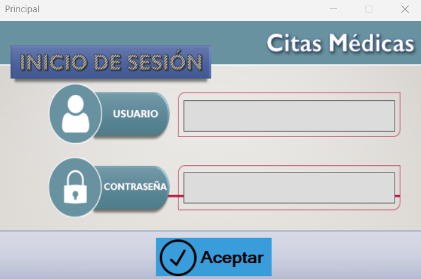
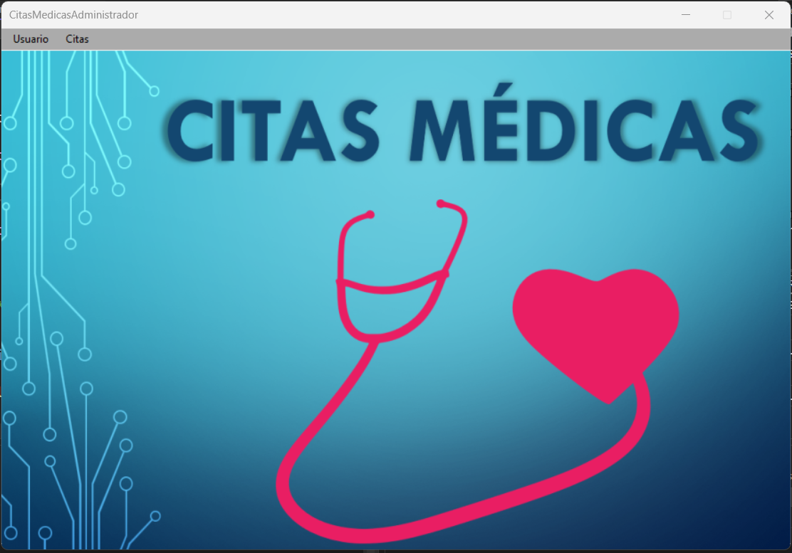
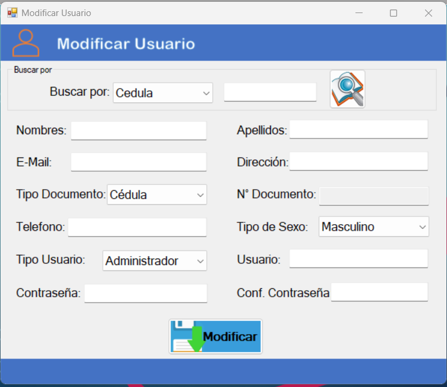
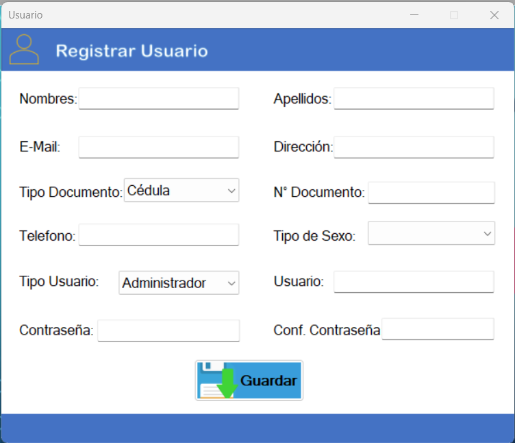
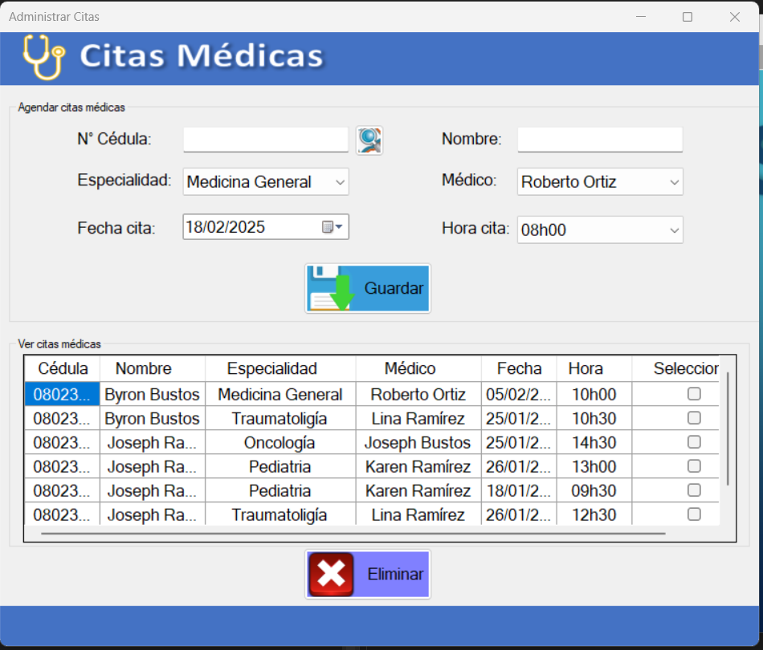

# Citas Medicas

Este es un proyecto enfocado al registro de cCitas Medicas. En este repositorio, encontrarás todos los archivos necesarios para usar y contribuir a este proyecto.

## Descripción

Este proyecto es una aplicación de escritorio que permite gestionar tareas de manera eficiente. Ofrece funcionalidades como agregar, eliminar y marcar las tareas.

## Características

- **Interfaz de usuario simple y clara**.
- **Persistencia de datos** usando bases de datos SQLServer.
- **Soporte para múltiples usuarios**.


## Instalación

Para instalar este proyecto en tu máquina local, sigue estos pasos:

1. Clona el repositorio en tu máquina:

    ```bash
    git clone https://github.com/byronjavi/CitasMedicas.git
    

## Uso

Puedes ejecutar la aplicacion y visualizar su funcionamiento.
- **El usuario es: bbustos y el password: BBcorp10** 
- **La Base de datos esta alojada en un servidor gratuito**

##

# Imagenes del proyecto


|  |  |  |
| -------------------------------------------------------- | ------------------------------------------------------------ | ----------------------------------------------------------------- |
|  | |
 
## Descargar el ejecutable

Haz clic en el siguiente enlace para descargar el archivo ejecutable:

[CitasMedicas.exe](https://github.com/byronjavi/CitasMedicas/raw/master/CitasMedicas/imagenes/CitasMedicas.exe)
